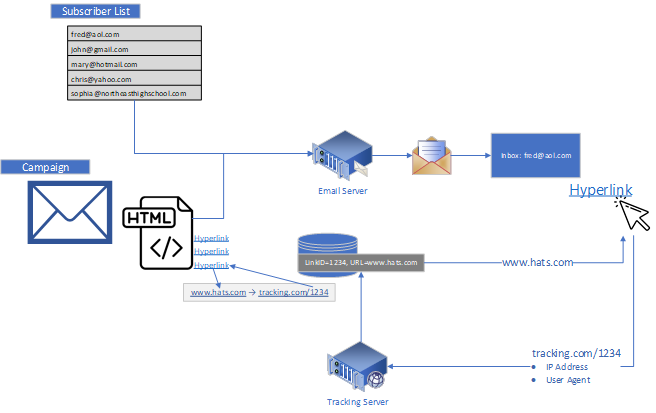
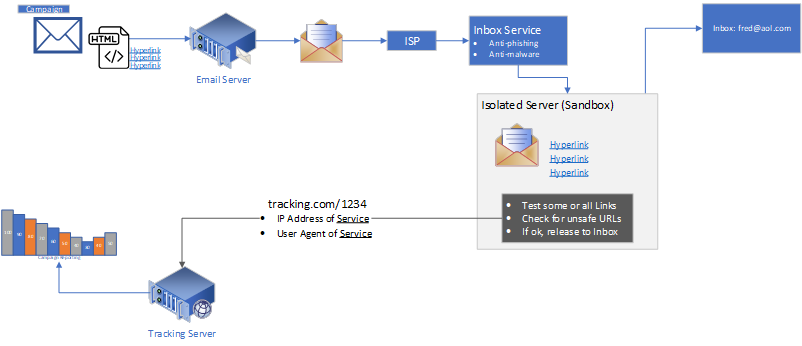
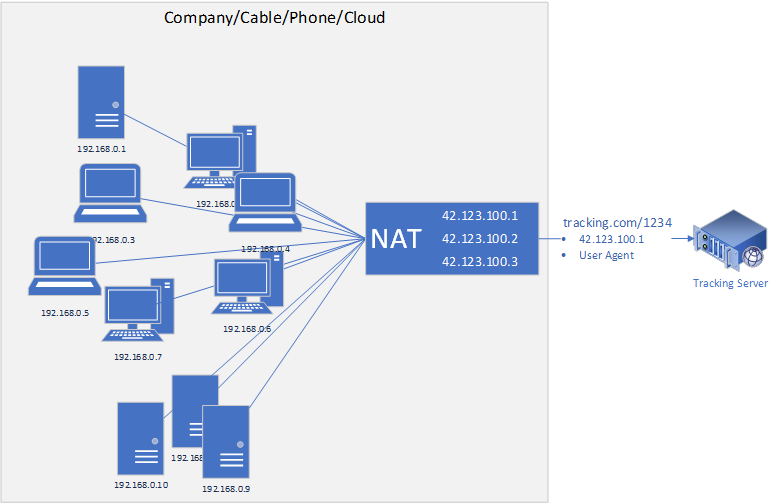
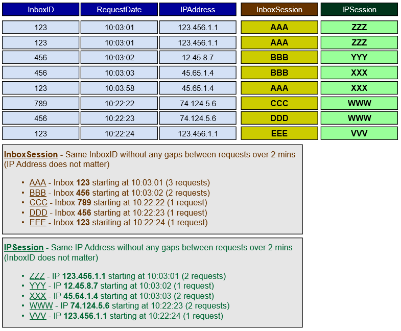
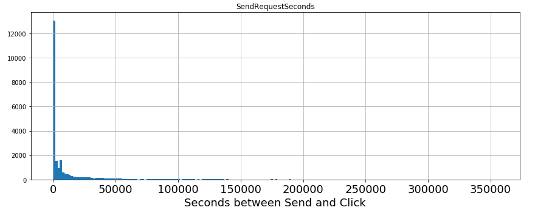
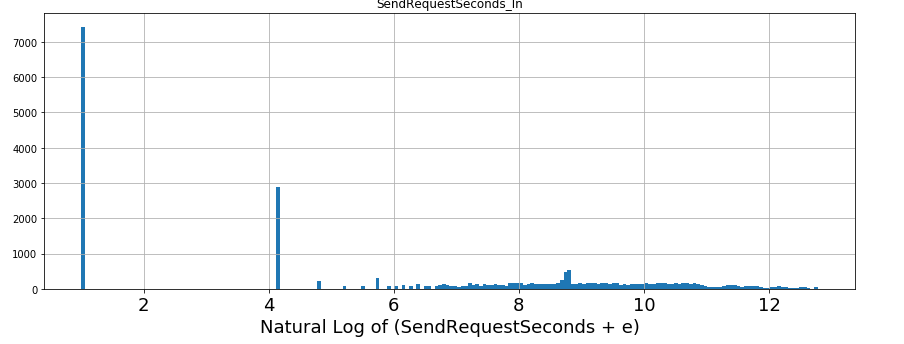
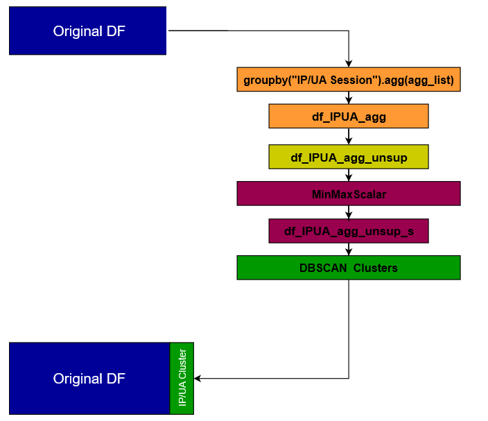
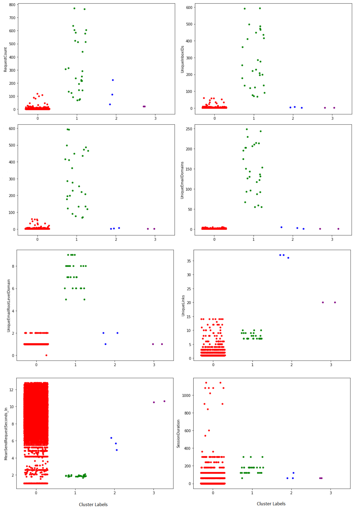
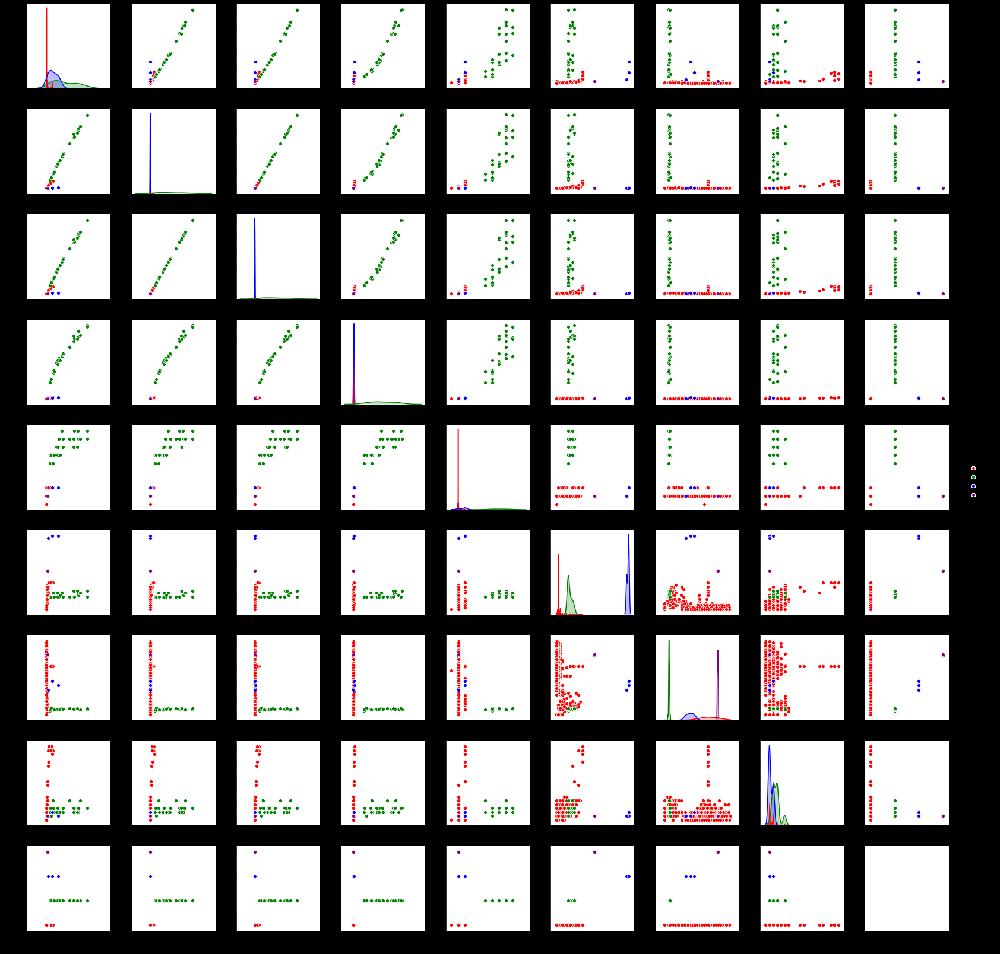
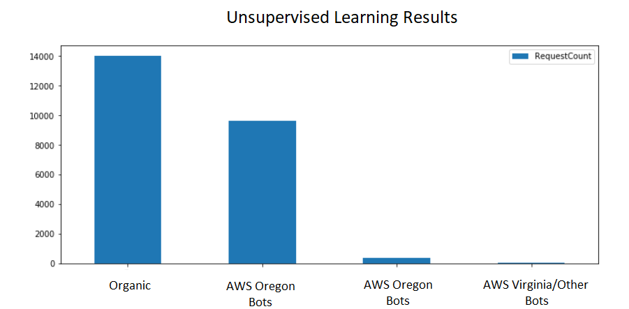

**Capstone Project 1: Milestone Report**
========================================

**Background**
--------------

Email marketing is a form of marketing where emails are sent to a list
of subscribers. This form of marketing is often used by e-commerce and
brick and mortar merchants as an effective way to increase sales and
engage customers. These email campaigns usually include sale items and
other offers as a way to increase traffic to their web sites and
encourage new orders. Virtually all of these items are links that take
the email contact to a specific location on the merchant's web site.

One of the most critical aspects of these email campaigns is the ability
to track click activity. The more clicks a campaign receives, the more
effect that campaign was. Links with relatively low click rates might
indicate the item or product did not present well in the message. New
campaigns with decreasing click rates might indicate a lack of interest,
poorly written subject lines, or displeasing message layouts.

**Click Tracking**
------------------

{width="6.609375546806649in"
height="4.162635608048994in"}

•When the contact clicks on a link, they are sent to the tracking server

•The tracking server looks up the original URL form the database

•A redirect to the original URL is sent back to the contact

•This automatically sends the contact to the proper URL

**Problem**
-----------

Email has also been an effective medium for malicious activity. Phishing
emails are becoming more of a problem each day. These malicious emails
are also getting much harder to recognize. This has generated a new
industry that offers services to help protect against phishing and
malware emails. Typically, these services will receive the email before
they go into the contact's inbox. The service will start up a protected
sandbox environment and programmatically click on some or all of the
links in the email. Based on the response from these clicks, the service
will either quarantine the email or pass it along to the contact's
inbox.

This type of service is very nascent at this point but growing at a
rapid rate. Through manually investigation, many of these services are
being used by schools to protect student accounts and computers. Both
high schools and colleges are adding this layer of protection, but
companies outside of education are also getting onboard with this type
of service.

The problem is that the current tracking systems cannot differentiate
between organic clicks from the actual contact vs. clicks from these
services. Since the bots behind these services usually check every email
received, a large percent of the clicks is coming from bots for some
campaigns. Though there is no desire to reject these click requests from
protective bots, the tracking of these clicks skew the click tracking
data. If campaigns are trending up with click rates, they may be from
more effective emails or from an increase in bot activity.

{width="6.5in" height="2.8055555555555554in"}

**Problem Detection**
---------------------

Though bots, both protective and malicious, have plagued email service
providers for years, the anti-phishing services have greatly increased
the activity. Instead of one or two bot clicks an hour, now up to 40% of
a send to 5 million contacts can be from bots. This was first detected
not as a bot problem, but as a tracking overload problem. Accounts with
large numbers of school aged contacts were the first to show signs. When
one of these accounts started a campaign send to a few million contacts,
the tracking system would get saturated for a few minutes. In fact, this
huge volume of clicks occurred at the start of the send when only 1% or
2% of the subscribers were sent to. Extensive research into these short
bursts of click activity using IP and MX lookups revealed the true
problem.

The protective services don't want to delay the contact from receiving
emails in their inbox. So, the services tend to perform the click
analysis as soon as the email is received. Unlike human activity where
the clicks would be spread out over a period of time and only a small
percent will engage with the campaign, bots respond immediately and
respond for every contact that received the message. This along with the
common practice for email service providers to send to the most engaged
contacts first, makes all the bot activity front loaded in the send
stream.

**Dataset**
-----------

The data is proprietary data obtained from employer. The data was
obtained via an audit of the raw clickstream. This audit data was stored
in a SQL database. Information was then pulled in about the contact
including the actual send time and added to the dataset. In addition,
information was obtained from IP Lookup data. This IP data includes the
CIDR range (blocks of purchased IP Addresses), the owner of the IP
block, the geolocation for that owner including their Olson time zone
name.

Since the data is proprietary, a large portion of the work was done in
SQL. This hidden work included any data cleansing needed, building and
populating the look up schema. There were about 6 to 8 lookup tables
with fairly complex joins performed to obtain the final result. This was
done on a very large dataset with millions of rows, even though only a
subset was used in this project.

The resulting dataset was then anonymized including IP Address, CIDR
range, email, email domain. The resulting dataset was approved by the
security team before it was used in this project.

**Subset**
----------

To limit the scope of the project as well as to reduce the row count to
a tenable size, only one campaign was obtained. This campaign was chosen
from an account with known bot activity. Research on the SQL side showed
that more than a dozen campaigns from this account showed very similar
click patterns with known bots. One of these campaigns was chosen at
random to be used in this project. This gave us over 24 thousand click
requests to work from. Note: The full campaign was sent to a few million
contacts and the click rate for this campaign was on par for the account
and similar to other account's click through rates. The clicks were
limited to activity within the first 100 hours after the send.

**HTTP Request Background**
---------------------------

The way most email service providers (ESP) do click tracking is to
rewrite the URL in the composed message. The rewritten URL includes
information about the specific send via the InboxID. This ID lets the
EPS lookup who the contact was that received the email along with the
campaign and link identifiers. When the contact (or bot) clicks on the
link, the EPS receives the request, looks up the original URL from the
LinkID and submits a redirect back to the contact. The contact's email
click sees the redirect and is then routed to the original URL. The ESP
knows who clicked on what link and when the click occurred. This
tracking data is stored and used in the reporting system(s).

Along with the click tracking data, the IP and User Agent (info about
the browser or email client) is submitted. Historically, when a bot was
discovered (usually malicious), the IP and/or User Agent was
blacklisted. The redirect was returned as normal, but the tracking data
was thrown away. But the anti-phishing services use cloud-based
platforms (i.e. AWS) which can offer thousands of IP addresses. Also, if
a phishing campaign can detect the anti-phishing bot, it can return a
safe URL with the redirect and wait until the organic click comes to
present the dangerous link. So, these services find creative ways to
hide their existence.

{width="6.5in" height="4.222222222222222in"}

**Sessionization**
------------------

Most email campaigns contain 30 to 100 links. A contact will frequently
click on several of these links. Almost always, these multiple clicks
occur back-to-back. One of the ways to judge a contact's behavior is to
group all of these back-to-back clicks as a single session. Some
sessions only have single click while other sessions may click on 15-20
clicks. The session is usually defined by recurring clicks with no more
than 2 minutes between clicks. If there is a larger gap than 2 minutes,
a new session is created with the next click request.

Sessions need to have some type of grouping. The same email or InboxID
is a good way to do sessions. But since we are looking for bots, we are
expecting that the same bot will click on many different messages
spanning different emails and InboxIDs. Since the IP and User Agent is
our best way to determine the source of the click request, it is logical
to build session grouping off of these 2 values. Normally, the same
device is being used by a single person, so the IP and UA tend to be
unique. But bots will tend to use the same server for many requests. So,
we would expect to see the IP/UA session for bots to include many emails
and many InboxIDs.

But because of Natting (Network Address Translation), the same public IP
can be used for many different computers. Natting is standard practice
for most larger companies, ISPs and phone companies. This means that
many different computers and/or people will use the same public IP.
Since more of the clicks from one of these environments, it will be
critical to differentiate these requests from bots.

{width="6.5in" height="5.361111111111111in"}

**Goal**
--------

Since the data is unlabeled, we need to use unsupervised learning. The
final goal is to be able to identify IP address (or CIDR ranges) and
User Agents used by bots. This way we can blacklist these IPs and User
Agent strings, so our reporting is not skewed by bot activity. The
tricky part is to find a way to differentiate bots on cloud services
from companies, ISPs and mobile phone systems that use Natting.

**Potential Approaches to Implementation in Production**
--------------------------------------------------------

Because we must use unsupervised learning and the fact that these
services are so nascent, we can't just move the model to production. So,
this leaves us with 2 options. The first is to leverage unsupervised
learning along with manual validation to extract thresholds in aggregate
features. These thresholds could be updated from time to time and used
in a production. For example, if we determine that more than 20 InboxIDs
in a single IP/UA session is assumed to be a bot, the click stream could
maintain sessions in memory and flag the tracking data as bot when 2
InboxIDs are reached. But this would be difficult since the requests
would have to be buffered until the session is. This would be difficult
when millions of clicks can come in for a single day.

A second and more simple approach would be to tap into the clickstream
data on a weekly/monthly basis. Run the same clustering approach on this
audit data and get the unlabeled clustered. Either manual or parameter
thresholds could be used to determine likelihood of the cluster as being
a bot. Once this is found, any new CIDR range/User Agent combination
could be appended to the blacklist.

**Data Prep**
-------------

Some of the prep along with the sessionization was moved to a separate
Python class in a standalone file (BotDataSet.py). This allows the
ability to reuse this class on different datasets. Since the data was
mostly prepared in SQL, very little data cleansing had to be done in
Python. There were some values in the IP hierarchy that had "unknown"
values that have to be changed to nan. 2 calculated columns were added.
Both of these columns were based on the time between the actual send
date and the time the click request came in. The first column was a
direct difference in seconds. But looking at the histogram for this
column, it was obvious that this feature followed some sort of an
exponential decay PDF. Plotting the histogram with a log y-axis did not
flatten this curve that much. A separate notebook was created to see if
we could fit this data to a Gamma function via Bayesian inference. This
was of limited success, but it did show extreme values for α and β, 0.16
and 207,482 respectively. This says that the time between the send and
the click responds tends to be extremely skewed to the left. This is
somewhat from the selection of the data with known bot activity reaching
40% of all clicks.

A second calculated column was added to the DataFrame to "tame" this
feature down. This feature will be a critical differentiator in our
clustering. We did not want to make it completely flat but needed some
way to prevent this feature from dominating the model. So, the log of
the duration between send and click was used. Euler\'s number was added
to the duration before the natural log was taken since *ln*() approaches
-∞ when the value nears zero.

{width="6.5in" height="2.5555555555555554in"}

$\text{SendRequestSeco}n\_\ln\  = log_{e}(SendRequestSeconds\  + \ e)$

{width="6.713542213473316in"
height="2.555544619422572in"}

**Sessionization**
------------------

This was also done in BotDataSet.py. This is a fairly complicated method
that required window functionality. Three elements are needed to achieve
the proper windowed result:

1\. Ordering by Click Date

2\. Grouping -- list of grouping features is passed into the function to
allow flexibility

3\. Termination of Session -- Within the window, the session is closed
if the previous Click Date is more than 120 seconds old

Three grouping approaches were built in the notebook. If the first did
not show success, the other groupings could be tried. The groups built
were

· InboxID

· IP Only

· IP and UA

Since the combination of IP address and User Agent has provided success
historically, it was the first tried. Since it proved to be successful,
the other grouping approaches did not progress to clustering.

As part of the sessionization, a unique session ID (i.e.
\"IPUASessionID\") is added to the original DataFrame. This session ID
is what the aggregation will be based on. It will also allow us to map
the aggregate clustering results back to the original df.

{width="5.40625in" height="4.673501749781277in"}

**Aggregation**
---------------

Now that we have our data prepped and sessionized, we need to derive
features from the group of click events that fall into the session
window. Possible aggregates include:

· Count

· Min/Max

· Mean/Variance/Standard Deviation

· Range

· Unique Values

Since the available aggregations would differ based on the grouping
approach, a list of aggregations was built for each grouping. For the
grouping approached used for this project, the aggregations chosen were:

· RequestCount

· Unique InboxIDs

· Unique Emails

· Unique Email Domains

· Unique Email Root Level Domains

· Unique Link URLs

· MeanSendReqeustSeconds

· SessionDuration

**Scaling and Covariance**
--------------------------

Each of these aggregate features were rescaled with the SKLearn
MinMaxScaller. The correlation matrix was then used to examine the
covariance between these aggregate features. Seaborn's pair plotting was
also used to examine all the combinations of scatter plots between all
features. It was expected that there would be a very high correlation
between features like unique emails and unique email domains. But we
would not reduce these features unless the clustering was not able to
finish in a reasonable time. Through investigation, it was found that
the anti-phishing bots are bound to a specific email domain. So even
with a Pearson Correlation approaching 1, this could still be a valuable
differentiator.

**K Means vs. DBSCAN**
----------------------

Looking at the pair plotting, most of the scatter plots showed strong
linear morphologies with not obvious distinct clustering. Though K means
was tried, DBSCAN was switched to very quickly. After some adjustments
to epsilon and min samples, a good result was found with 4 clusters.

**Visualization of Clustering Results**
---------------------------------------

Using both strip plots and pair plotting, it was easy to see the
differentiation in feature value ranges between the different clusters.
The majority of the data fell into 2 clusters, 0 (red) and 1 (green).
For virtually all the aggregate features used, one of the clusters
showed a large range of values while the other showed a very compact
range.

  Feature                       Cluster 0 (Red)   Cluster 1 (Green)
  ----------------------------- ----------------- -------------------
  Request Count (Click Count)   Small Range       Large Range
  Unique InboxIDs               Small Range       Large Range
  Unique Emails                 Small Range       Large Range
  Unique Email Domains          Small Range       Large Range
  Unique Root Level Domains     2 values          Medium Range
  Unique Links                  Medium Range      Small Range
  Mean Send to Click Duration   Large Range       Small Range
  Session Duration              Large Range       Medium Range

### 

### Scatter Plots by Label

### {width="5.697397200349957in" height="8.244792213473316in"}

###  Clustering and Pair Plots

The pair plots showed a very nice separation between groups. There were
no gaps in some of the scatter plots, but most appear to be logically
separated.

{width="6.5in" height="6.208333333333333in"}

Group numbers 2 and 3 did not have large enough numbers so make
assumptions about ranges or the scatter plots.

A bar plot of the 4 clusters shows that clusters 0 and 1 held the vast
majority of the click requests.

Note: The clustering changes with each run even if the random see is
set. So, this reference to the color and number of the clustered is
based on the final run.

**Merging Aggregate Clustering back into Raw DataFrame**
--------------------------------------------------------

The clustering was based on sessions which were based on grouping
requests by IP and User Agent. Each session was given a unique
IPUASessionID. This ID allows us to merge the clustering results back
into the original DataFrame.

The results of this merge are interesting. If a contact clicks on 5
links at 9:00AM and then 1 click at 2:00PM, that contact would have
generated 2 sessions. Since the unsupervised learning was done on the
session and not the contact, that contact's 2 sessions might have
different cluster labels.

The same can be said for the CIDR range or AS Name (owner of the IP
blocks). Some CIDR blocks might have many sessions and these sessions
can have different clusters. So, for some CIDR ranges, only one or 2
sessions might have a cluster associated with bot activity, and have
many sessions associated with a cluster identified as organic clicks.
This will allow us to score IP/UA combinations and CIDR ranges based on
how many click requests were in bot clusters. This way, we end up with a
majority rules basis for determining if the source IP/CIDR is a bot.

**CIDR and AS Name Distributions**
----------------------------------

It was known that AWS (specifically the Oregon data center) is
associated with most of the anti-phishing bots. If we do group by
queries with the merge DataFrame, we can see how the AS Name, AS Number
and CIDR click request counts match each of the 4 clusters found.

These results were surprisingly good! Clusters 1, 2 and 3 only came from
AWS with 1 exception. Cluster 3 had 36 click requests from DigitalOcean,
LLC, another cloud provider.

Looking at the AS Number (usually a specific data center), cluster 1 and
2 all came from AWS Oregon and cluster 3 came from AWS Virginia and
Digital Ocean. Chances are the Virginia data center hosts a different
anti-phishing service than Oregon.

**Manual Labeling**
-------------------

The labeled original DataFame was saved and loaded back into the SQL
database where the audit data was hosted. Using random samples (\~50 for
each cluster), clusters 1, 2 and 3 had very strong evidence of bot
activity. Whereas cluster 0 looked would be considered organic clicks.

**CIDR Reputation**
-------------------

The CIDR reputation is a score that is based on what percentage of the
sessions were in bot clusters. There were 13 CIDR ranges that had
sessions that had clustered assigned as bots. Some of these CIDR ranges
had sessions that were in the organic cluster. This is not unexpected,
but of the 13 CIDR ranges, the lowest CIDR reputation score is 90%. The
next lowest score was over 97%. Based on these results, chances are the
few sessions that did not get placed in a bot cluster were still from a
bot source.

$ReputationScore\  = \ \frac{SessionCount(Label\  > \ 0)}{SessionCount(All\ Labels)}$

**Results**
-----------

Since we used unsupervised learning, we can't show metrics like accuracy
or ROC curves. But we have an advantage here in that these types of bots
are in their nascent phase. Because of this, we can fairly accurately
identify almost all of the bots simply by identifying the owner of the
IP blocks. Any request coming from AWS is almost certain to be a bot. We
did see some bot activity from Digital Ocean's data center with manual
investigation, but no other data center or ISP was found to be
associated with bot activity.

This assumption will not hold for long. If these types of helpful bots
become more prevalent, we will need more sophisticated methods to
checking accuracy, but for now the data center is probably accurate.

Below is a breakdown of the owner of the IP Address (AS Name) along with
the counts for each unsupervised label assigned. Just looking at AWS and
assuming all AWS requests are bots, we can get a rough idea of the
accuracy we achieved.

$Accuracy\  = \ \frac{9,608\  + \ 333\  + \ 40}{11.139}\  = \ 89.6\%$

Chances are the \~10% of the AWS requests that got grouped into the
Organic label were underrepresented with only one or two clicks in a
session. Running the clustering with larger datasets would probably find
more sessions of these CIDR ranges and increase the accuracy.

+----------+----------+----------+----------+----------+----------+
| **Owner  | **0**    | **1**    | **2**    | **3**    | *        |
| of IP    |          |          |          |          | *Total** |
| A        | **O      | **AWS    | **AWS    | **AWS    |          |
| ddress** | rganic** | (O       | (O       | (Vir     |          |
|          |          | regon)** | regon)** | ginia)** |          |
+==========+==========+==========+==========+==========+==========+
| **Ama    | **1158** | **9608** | **333**  | **40**   | *        |
| zon.com, |          |          |          |          | *11139** |
| Inc.**   |          |          |          |          |          |
+----------+----------+----------+----------+----------+----------+
| **U      | *        | **0**    | **0**    | **0**    | *        |
| nknown** | *10562** |          |          |          | *10562** |
+----------+----------+----------+----------+----------+----------+
| **AT&T   | **1118** | **0**    | **0**    | **0**    | **1118** |
| Mobility |          |          |          |          |          |
| LLC**    |          |          |          |          |          |
+----------+----------+----------+----------+----------+----------+
| **MCI    | **294**  | **0**    | **0**    | **0**    | **294**  |
| Commun   |          |          |          |          |          |
| ications |          |          |          |          |          |
| S        |          |          |          |          |          |
| ervices, |          |          |          |          |          |
| Inc.     |          |          |          |          |          |
| Verizon  |          |          |          |          |          |
| Bu       |          |          |          |          |          |
| siness** |          |          |          |          |          |
+----------+----------+----------+----------+----------+----------+
| **       | **253**  | **0**    | **0**    | **0**    | **253**  |
| T-Mobile |          |          |          |          |          |
| USA,     |          |          |          |          |          |
| Inc.**   |          |          |          |          |          |
+----------+----------+----------+----------+----------+----------+
| *        | **217**  | **0**    | **0**    | **0**    | **217**  |
| *Scalair |          |          |          |          |          |
| SAS**    |          |          |          |          |          |
+----------+----------+----------+----------+----------+----------+
| **Cen    | **91**   | **0**    | **0**    | **0**    | **91**   |
| turyLink |          |          |          |          |          |
| Communi  |          |          |          |          |          |
| cations, |          |          |          |          |          |
| LLC**    |          |          |          |          |          |
+----------+----------+----------+----------+----------+----------+
| **Google | **86**   | **0**    | **0**    | **0**    | **86**   |
| LLC**    |          |          |          |          |          |
+----------+----------+----------+----------+----------+----------+
| *        | **81**   | **0**    | **0**    | **0**    | **81**   |
| *Comcast |          |          |          |          |          |
| Cable    |          |          |          |          |          |
| Communi  |          |          |          |          |          |
| cations, |          |          |          |          |          |
| LLC**    |          |          |          |          |          |
+----------+----------+----------+----------+----------+----------+
| **Digit  | **20**   | **0**    | **36**   | **0**    | **56**   |
| alOcean, |          |          |          |          |          |
| LLC**    |          |          |          |          |          |
+----------+----------+----------+----------+----------+----------+
| **Level  | **54**   | **0**    | **0**    | **0**    | **54**   |
| 3        |          |          |          |          |          |
| Parent,  |          |          |          |          |          |
| LLC**    |          |          |          |          |          |
+----------+----------+----------+----------+----------+----------+
| **Wi     | **31**   | **0**    | **0**    | **0**    | **31**   |
| ndstream |          |          |          |          |          |
| Commun   |          |          |          |          |          |
| ications |          |          |          |          |          |
| LLC**    |          |          |          |          |          |
+----------+----------+----------+----------+----------+----------+
| **TELUS  | **27**   | **0**    | **0**    | **0**    | **27**   |
| Commun   |          |          |          |          |          |
| ications |          |          |          |          |          |
| Inc.**   |          |          |          |          |          |
+----------+----------+----------+----------+----------+----------+
| **Shaw   | **16**   | **0**    | **0**    | **0**    | **16**   |
| Commun   |          |          |          |          |          |
| ications |          |          |          |          |          |
| Inc.**   |          |          |          |          |          |
+----------+----------+----------+----------+----------+----------+
| **M      | **12**   | **0**    | **0**    | **0**    | **12**   |
| icrosoft |          |          |          |          |          |
| Corpo    |          |          |          |          |          |
| ration** |          |          |          |          |          |
+----------+----------+----------+----------+----------+----------+
| *        | **6**    | **0**    | **0**    | **0**    | **6**    |
| *GENESCO |          |          |          |          |          |
| INC**    |          |          |          |          |          |
+----------+----------+----------+----------+----------+----------+
| **Johns  | **4**    | **0**    | **0**    | **0**    | **4**    |
| Hopkins  |          |          |          |          |          |
| Univ     |          |          |          |          |          |
| ersity** |          |          |          |          |          |
+----------+----------+----------+----------+----------+----------+
| **DoD    | **3**    | **0**    | **0**    | **0**    | **3**    |
| Network  |          |          |          |          |          |
| Inf      |          |          |          |          |          |
| ormation |          |          |          |          |          |
| Center** |          |          |          |          |          |
+----------+----------+----------+----------+----------+----------+
| **       | **3**    | **0**    | **0**    | **0**    | **3**    |
| Sprint** |          |          |          |          |          |
+----------+----------+----------+----------+----------+----------+
| **Cellco | **3**    | **0**    | **0**    | **0**    | **3**    |
| Par      |          |          |          |          |          |
| tnership |          |          |          |          |          |
| DBA      |          |          |          |          |          |
| Verizon  |          |          |          |          |          |
| Wi       |          |          |          |          |          |
| reless** |          |          |          |          |          |
+----------+----------+----------+----------+----------+----------+
| **Cogent | **2**    | **0**    | **0**    | **0**    | **2**    |
| Communic |          |          |          |          |          |
| ations** |          |          |          |          |          |
+----------+----------+----------+----------+----------+----------+

{width="6.5in" height="3.1944444444444446in"}

**Future Work**
---------------

There is still a lot of work that could be done here. Running a larger
dataset that spans multiple campaigns and accounts would be a good first
step. Since currently the anti-phishing bots seem to be associated with
schools, finding subscriber lists whose makeup is from an older
population would be important to check. Do these findings still hold up
with different contact distributions?

A quick attempt was made with a large dataset but ran into scaling
issues with DBSCAN. HDBSCAN was tried once but was dropped due to scope
of the project. Larger datasets would be important to capture all the
CIDR ranges associated with bot activity. Since this dataset was from a
single campaign, chances are not all the available CIDR ranges from AWS
were present. A quick analysis from other campaigns from this same
account indicated that only about 60% of the CIDR ranges were
identified.

A much better approach to using this in production would be the next
major effort. Rerunning the clustering on new audit data makes sense,
but there is still a lot of subjectivity on assigning clusters as bot
sources. For now, we could be just as effective in blacklisting any
request from an AWS CIDR, but the landscape is rapidly changing and this
assumption could become very inaccurate in a very short period of time.
